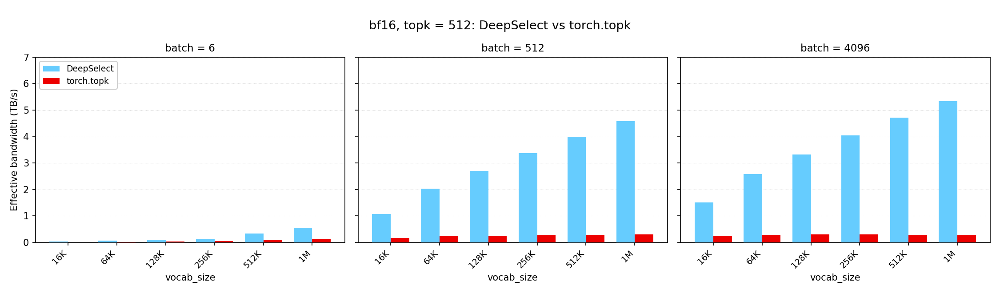
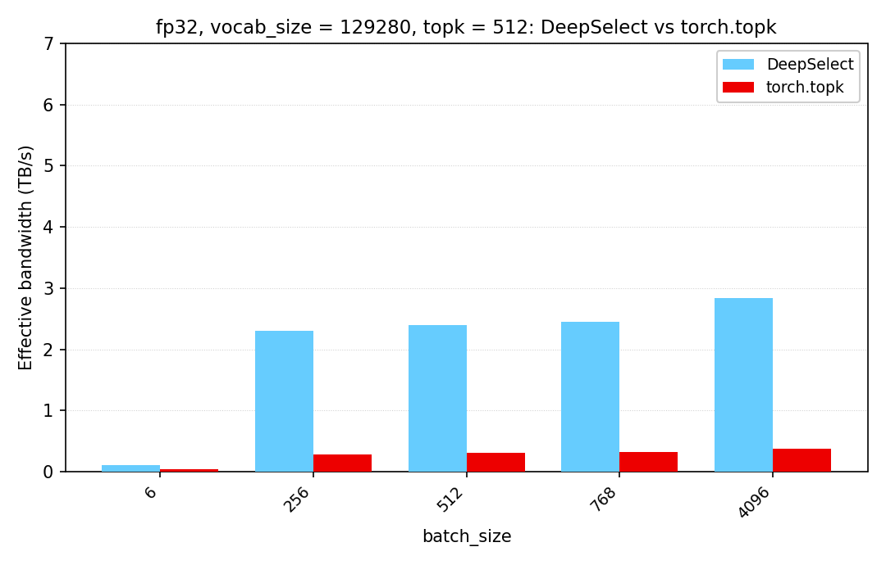

# DeepSelect

DeepSelect is a high performance implementation of the TopK kernel used in DeepSeek Sparse Attention (DSA) (which is used in DeepSeek V3.2, DeepSeek V4, and DeepSeek V4.1 models) and the sampler. It achieves 2 ~ 20x speedup compared to vanilla `torch.topk`.

## News

- 2026.09.10: We've released a brief analysis of the algorithm and its implementation: [English](docs/DeepSelect-deep-dive.md) | [中文](docs/DeepSelect-deep-dive.zh.md)
- 2026.09.10: We've released DeepSelect v1.0.0

## Supported Cases

TopK workloads vary widely, and the fastest algorithm & implementation highly depends on the input dtype, `batch_size`, `vocab_size`, and `topk`. This repository only focuses on the following cases:

### Lightning Indexer Scenario

This scenario covers:
- Input dtype: `torch.bfloat16`
- `batch_size`: $1 \sim +\infty$ (both large and small batch sizes are optimized)
- `vocab_size`: $1 \sim +\infty$ (both large and small vocabularies are optimized)
- `topk`: small (must be $\le 4096$; larger values are not supported)

Recommendations:
- Disable `sorted_index` unless the output has to be ordered by index or by value; enabling either one costs performance.
- Set `return_value=False` when the values are not needed. This skips the value output and is faster.

### Sampling Scenario

This scenario covers:
- Input dtype: `torch.float32`
- `batch_size`: $1 \sim +\infty$
- `vocab_size`: around 128K
- `topk`: small (must be $\le 4096$; larger values are not supported)

## Performance

Measured with the benchmark in [`tests/test.py`](tests/test.py)
(`python3 tests/test.py --perf-only`), which reports the ratio against `torch.topk`
on the same input. The metric is effective memory bandwidth: TopK does no
floating-point math, so a FLOP rate would not be meaningful here.

### Lightning Indexer Scenario

bfloat16, `topk = 512`, one subplot per batch size, on a shared 0 - 7 TB/s axis.



### Sampling Scenario

float32, `vocab_size = 129280`, `topk = 512`.



## Installation

```bash
git clone https://github.com/deepseek-ai/DeepSelect.git
cd DeepSelect
git submodule update --init --recursive
pip install -v .
```

## Usage

```python
import torch
import deep_select

# input: (batch_size, vocab_size), torch.bfloat16 or torch.float32.
# Its row stride must be a multiple of `deep_select.get_stride_requirement()[0]` bytes, and its last dimension must be contiguous.
batch_size, vocab_size, topk = 4, 204800, 1024

x = torch.randn(batch_size, vocab_size, dtype=torch.bfloat16, device="cuda")

values, indices = deep_select.topk(
    x,
    topk,
    sorted_index=True,         # return each row's indices in ascending order
    indices_type=torch.int32,  # torch.int32 or torch.int64
    return_value=True,         # False skips the value output (~10% faster)
)
# values:  (batch_size, topk) of x.dtype
# indices: (batch_size, topk) of indices_type
```

The row stride of the input tensor (`x`) must be aligned to `deep_select.get_stride_requirement()[0]` bytes. For unaligned inputs, padding is necessary.

Both outputs are allocated by the call, and their strides are aligned to `deep_select.get_stride_requirement()[1]` bytes (so they may be non-contiguous). Pass `output_idx=` to write indices into a buffer you own, and that buffer must satisfy the same stride requirement.

For the full signature, see [`deep_select/interface.py`](deep_select/interface.py).

### Variable-length rows

`end` sets a per-row upper bound (exclusive). Rows shorter than `topk` are padded with
`value_oob_fill_value` / `idx_oob_fill_value`:

```python
batch_size, vocab_size = 2, 129280   # 129280 is a multiple of 256, so float32 is fine
x = torch.randn(batch_size, vocab_size, dtype=torch.float32, device="cuda")

end = torch.tensor([129280, 100000], dtype=torch.int32, device="cuda")  # (batch_size,)
values, indices = deep_select.topk(x, 1000, end=end, sorted=True,
                                   indices_type=torch.int64)
```

### NaN handling

NaN checking is always on. With the default `abort_when_nan_found=True` the kernel invokes `trap()` and aborts. Rows whose length is `<= topk` are never NaN-checked.

## Citation

```text
@misc{deepselect2026,
    title={DeepSelect: High-Performance TopK Kernels for DeepSeek Sparse Attention and Sampling},
    author={Yi Qian and Shengyu Liu and Yichen Li},
    year={2026},
    publisher = {GitHub},
    howpublished = {\url{https://github.com/deepseek-ai/DeepSelect}},
}
```
